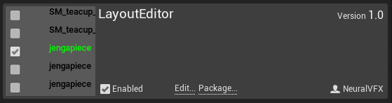
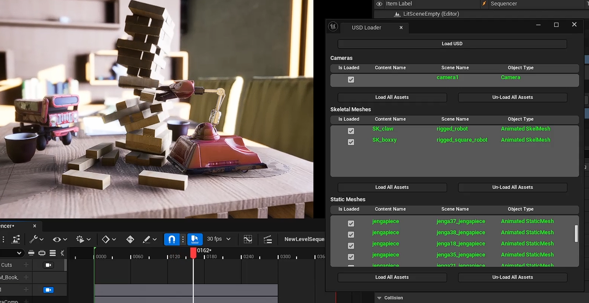
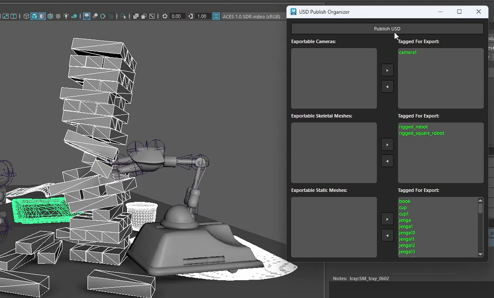

# Unreal Side

## Requirements:

- Unreal Engine 5.8

## Project Setup

- Make a C++ Unreal Project 
- Make sure you have a `Plugins` folder inside of the project
- Clone this Repo into the plugins folder (Or download the zip file and unzip there)
- Right click your `.uproject` file and click `Generate Visual Studio Project Files`
- Compile the project from Visual Studio
- From `Edit->Plugins`, locate the `Installed` or 'Other' Tab
- Find  `LayoutEditor` and click `Enable`

## Scene Setup

- Make sure that your level has a `LevelSequenceActor` added to it
- Also make sure that your `LevelSequenceActor` has a `LevelSequence` selected
- In the `Content Manager`, navigate to `LayoutEditor Content`
- Right click `JsonLayoutLoader` and click `Run Editor Utility Widget`

## Import a USD file

- Click `Load USD` and select your USD file
- Assets will be listed with a checkbox in the GUI
- Check or un-check the boxes one by one to load and unload individual objects
- Click `Load All Assets` or `Unload All Assets` to add or remove all objects at once

# Maya Side

## Requirements:

- Maya 2027

## Project Setup

- A [sample python script](https://github.com/NeuralVFX/unreal-usd-layout-plugin/blob/main/maya_example.py) is provided which executes the publish
- Each studio has different naming an publishing conventions, so this is a bare bones example
  
### Requirements

- Both rigs and props must be published, and referenced into animation scene
- All assets need `.unrealAssetPath` and `.unrealSceneName` attrs on top node
- Rigs must have top group named `Rig_Root`

## Export a USD file

- Run the script
- Select the object and click the `>` button to tag it for export
- Click `Publish USD` and type your filename in
  

